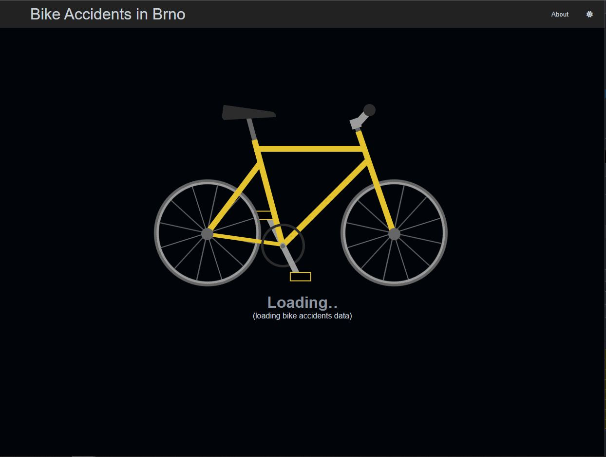
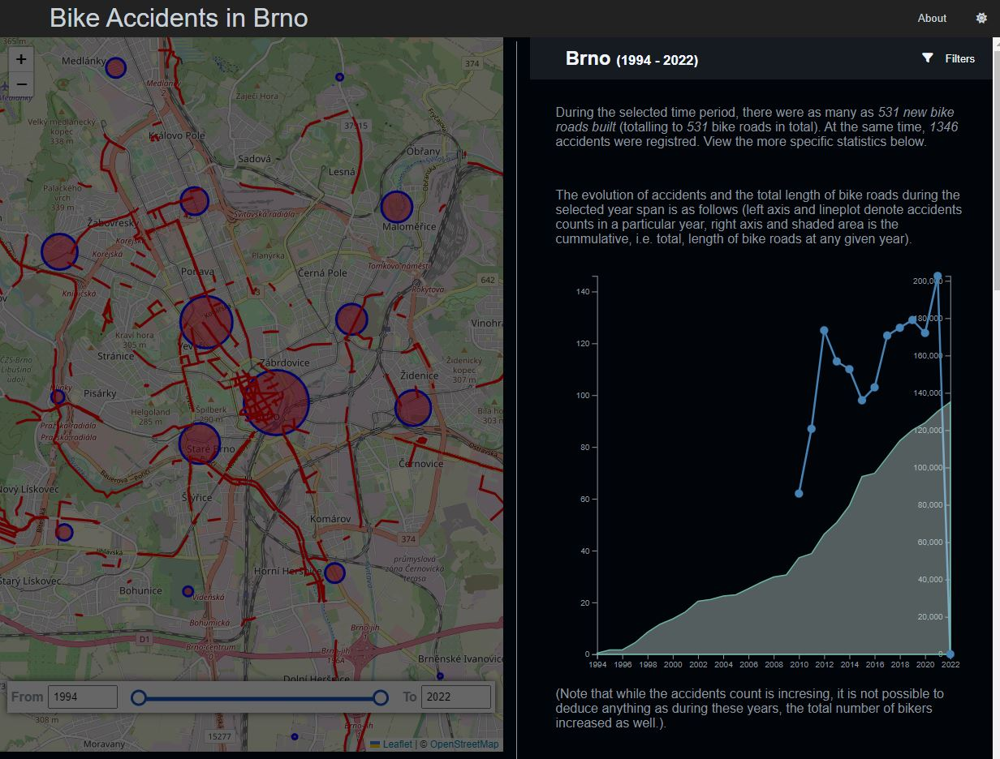
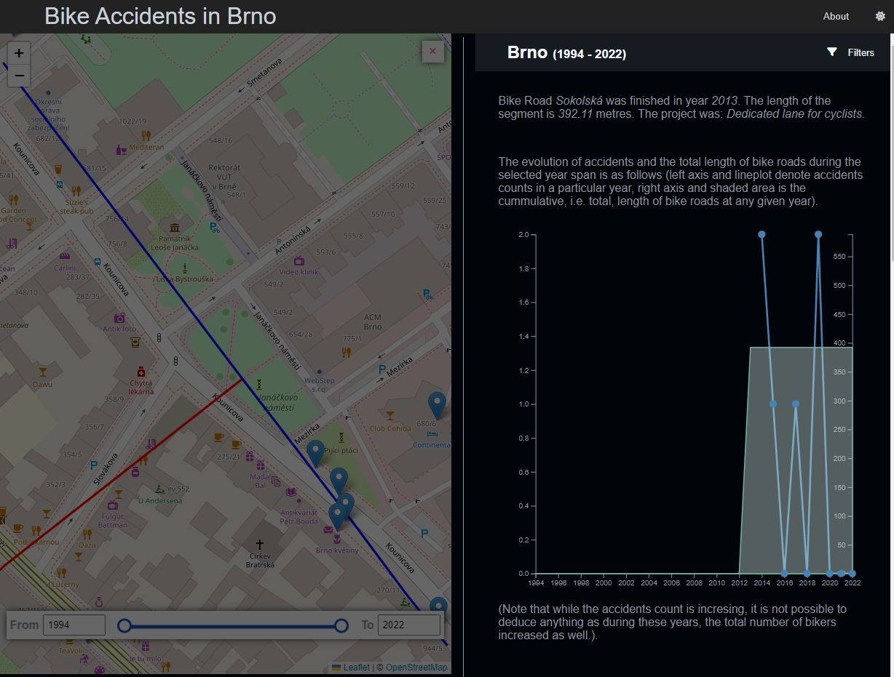

# Bike Accidents in Brno

The visualisation of bike accidents connected to (non-)existing bike roads
in Brno. The main idea is to show how a bike road can influence the mortality
and counts of accidents.

This project represents the final visualisation project from the subject
`FI:PV251` at _Faculty of Informatics, Masaryk University_ (autumn 2022).

## Images

## Data

The presented data are accessible at [Brno public data](https://data.brno.cz/):

* accidents [here](https://data.brno.cz/datasets/mestobrno::cyklistick%C3%A9-nehody-bike-accidents/about)
* the cycling roads [here](https://data.brno.cz/datasets/mestobrno::cykloopat%C5%99en%C3%AD-zrealizovan%C3%A1-cycling-infrastructure-existing/about)

## Other sources

Amazing vizualisation also at [https://storymaps.arcgis.com/stories/ac4013968cc64728b5663b375f7a372c](https://storymaps.arcgis.com/stories/ac4013968cc64728b5663b375f7a372c).

CSS animations:
* [loading text](https://codepen.io/thetallweeks/pen/yybGra)
* [bike](https://codepen.io/lucawater/pen/VwQVyj)

JavaScript functionality inspirations:
* [range slider](https://w3collective.com/double-range-slider-html-css-js/)
